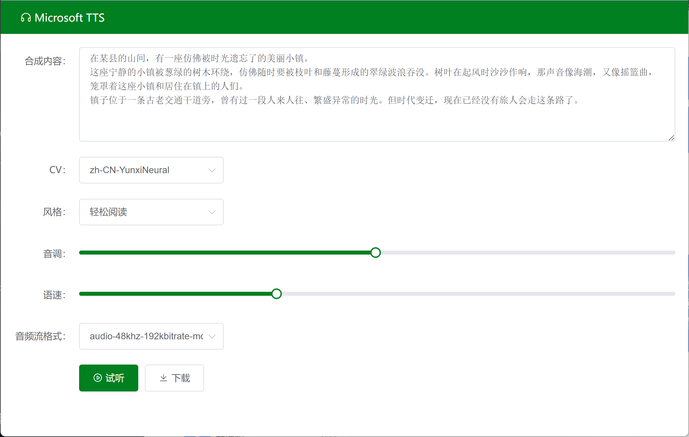

# tts-server-frontend
给 https://github.com/litcc/tts-server
做了个网页界面




使用方法：
把构建输出的东西扔到一个web服务器下，然后把发送到/tts-ms的请求转发到tts-server上。例如用nginx的proxy-pass

## Project setup
```
npm install
```

### Compiles and hot-reloads for development
```
npm run serve
```

### Compiles and minifies for production
```
npm run build
```

### Lints and fixes files
```
npm run lint
```

### Customize configuration
See [Configuration Reference](https://cli.vuejs.org/config/).
